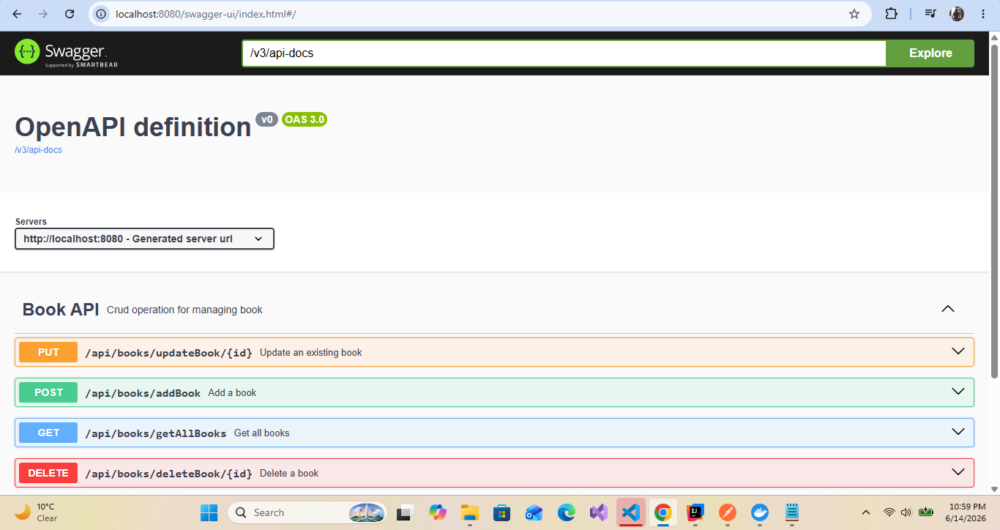

# 📚 Catalogue Management API

A backend REST API built with **Java 17 and Spring Boot** for managing a personal book catalogue.

The application provides CRUD operations for books and follows a layered architecture using **Controller → Service → Repository** separation. It uses **PostgreSQL** for persistent data storage and includes **Swagger/OpenAPI documentation, automated testing, Docker, Docker Compose, and GitHub Actions CI**.

The project is designed to demonstrate practical backend development practices, including REST API design, database persistence, testing, containerisation, environment-based configuration, and continuous integration.

---

## 🚀 Project Overview

The Catalogue Management API allows clients to:

* 📖 View all books
* 🔍 Find a book by ID
* ➕ Add a new book
* 📝 Update an existing book
* ❌ Delete a book
* 📚 Manage catalogue data through REST endpoints
* 📋 Explore and test the API using Swagger UI

The application follows a layered architecture to separate HTTP handling, business logic, and data access responsibilities.

---

## 🏗️ System Architecture

The application uses a layered architecture with Spring Boot and PostgreSQL.

```text
                         Client
                           │
                           │ HTTP Request
                           ▼
                   ┌───────────────┐
                   │    REST API   │
                   └───────┬───────┘
                           │
                           ▼
                   ┌───────────────┐
                   │   Controller  │
                   └───────┬───────┘
                           │
                           ▼
                   ┌───────────────┐
                   │    Service    │
                   └───────┬───────┘
                           │
                           ▼
                   ┌───────────────┐
                   │   Repository  │
                   └───────┬───────┘
                           │
                           ▼
                   ┌───────────────┐
                   │  PostgreSQL   │
                   └───────────────┘
```

### Architecture Layers

#### Controller

Handles incoming HTTP requests and returns HTTP responses.

#### Service

Contains the application's business logic and coordinates operations between controllers and repositories.

#### Repository

Uses **Spring Data JPA** to communicate with PostgreSQL.

#### PostgreSQL

Provides persistent relational data storage for the book catalogue.

---

# 🛠️ Tech Stack

| Technology            | Purpose                                |
| --------------------- | -------------------------------------- |
| **Java 17**           | Programming language                   |
| **Spring Boot 3**     | Backend framework                      |
| **Spring Web**        | REST API development                   |
| **Spring Data JPA**   | Database persistence                   |
| **PostgreSQL**        | Relational database                    |
| **Maven**             | Build and dependency management        |
| **Swagger / OpenAPI** | Interactive API documentation          |
| **JUnit**             | Automated testing                      |
| **Mockito**           | Mocking and test isolation             |
| **Docker**            | Application containerisation           |
| **Docker Compose**    | Application and database orchestration |
| **GitHub Actions**    | Continuous integration                 |

---

# 📦 Features

### Book Management

* Get all books
* Get a book by ID
* Create a book
* Update a book
* Delete a book

### REST API

The application exposes RESTful endpoints for interacting with catalogue data.

### Swagger / OpenAPI

Swagger provides an interactive interface for exploring and testing the API directly from a browser.

### Automated Testing

The project includes automated tests using:

* JUnit
* Mockito
* Spring Boot Test

### Docker

The Spring Boot application can be packaged and executed inside a Docker container.

### Docker Compose

Docker Compose runs the complete application stack:

```text
┌───────────────────────────────────────┐
│           Docker Compose              │
│                                       │
│  ┌─────────────────┐                  │
│  │   Spring Boot   │                  │
│  │   Application   │                  │
│  │     :8080       │                  │
│  └────────┬────────┘                  │
│           │                           │
│           │ JDBC                      │
│           ▼                           │
│  ┌─────────────────┐                  │
│  │    PostgreSQL    │                  │
│  │      :5432       │                  │
│  └─────────────────┘                  │
│                                       │
└───────────────────────────────────────┘
```

A developer can start both services with:

```bash
docker compose up --build
```

### CI

GitHub Actions automatically builds and tests the project when changes are pushed or pull requests are created.

---

# 🔌 API Endpoints

| Method   | Endpoint          | Description       |
| -------- | ----------------- | ----------------- |
| `GET`    | `/api/books`      | Get all books     |
| `GET`    | `/api/books/{id}` | Get a book by ID  |
| `POST`   | `/api/books`      | Create a new book |
| `PUT`    | `/api/books/{id}` | Update a book     |
| `DELETE` | `/api/books/{id}` | Delete a book     |

### Example Request

```http
GET /api/books
```

### Example Response

```json
[
  {
    "id": 1,
    "title": "Clean Code",
    "author": "Robert C. Martin"
  }
]
```

> The example response should be updated if your actual API uses different fields.

---

# 📁 Project Structure

```text
catalogue-management/
│
├── src/
│   ├── main/
│   │   ├── java/
│   │   │   └── ...
│   │   │
│   │   └── resources/
│   │       └── application.yml
│   │
│   └── test/
│       └── java/
│           └── ...
│
├── .dockerignore
├── .env.example
├── .gitignore
├── Dockerfile
├── docker-compose.yml
├── pom.xml
├── README.md
└── .github/
    └── workflows/
        └── ...
```

---

# ⚙️ Getting Started

## Prerequisites

### Option 1 — Docker

For the easiest setup, install:

* Docker Desktop

Docker Compose is included with modern Docker Desktop installations.

### Option 2 — Local Development

For running the application directly on your machine, install:

* Java 17
* Maven
* PostgreSQL

---

# 🐳 Running with Docker Compose

Docker Compose is the recommended way to run the complete application.

## 1. Clone the Repository

```bash
git clone https://github.com/kaahoza/Catalogue-Management.git
cd Catalogue-Management
```

## 2. Configure Environment Variables

The project uses environment variables for database configuration.

Create a local `.env` file in the project root:

```env
POSTGRES_DB=catalogue_db
POSTGRES_USER=catalogue_user
POSTGRES_PASSWORD=catalogue_password
```

> The `.env` file should not be committed to GitHub.

A `.env.example` file is included in the repository to show the required configuration.

## 3. Build and Start the Application

Run:

```bash
docker compose up --build
```

Docker Compose will:

1. Build the Spring Boot application image.
2. Start PostgreSQL.
3. Wait for PostgreSQL to become healthy.
4. Start the Spring Boot application.
5. Connect Spring Boot to PostgreSQL through the Docker network.

The application will be available at:

```text
http://localhost:8080
```

## 4. Run in the Background

```bash
docker compose up -d
```

## 5. Check Running Containers

```bash
docker compose ps
```

You should see both services running:

```text
catalogue-management
catalogue-postgres
```

## 6. View Application Logs

```bash
docker compose logs -f app
```

To view all logs:

```bash
docker compose logs -f
```

## 7. Stop the Application

```bash
docker compose down
```

The PostgreSQL data is persisted using a Docker named volume.

## 8. Remove the Database Volume

To completely remove the containers and PostgreSQL data:

```bash
docker compose down -v
```

> Use this command carefully because removing the volume deletes the database data stored in the Docker volume.

---

# 💻 Running Locally Without Docker

Docker Compose is recommended, but the application can also be run directly using Java and PostgreSQL.

## 1. Start PostgreSQL

Create a PostgreSQL database:

```sql
CREATE DATABASE catalogue_db;
```

Then configure the appropriate database credentials using environment variables or your local development configuration.

The application's `application.yml` supports environment-based configuration:

```yaml
spring:
  datasource:
    url: ${SPRING_DATASOURCE_URL:jdbc:postgresql://localhost:5432/catalogue_db}
    username: ${SPRING_DATASOURCE_USERNAME:postgres}
    password: ${SPRING_DATASOURCE_PASSWORD:postgres}
    driver-class-name: org.postgresql.Driver

  jpa:
    hibernate:
      ddl-auto: update
    show-sql: true
    properties:
      hibernate:
        format_sql: true
```

## 2. Build the Application

```bash
mvn clean package
```

## 3. Run the Application

```bash
mvn spring-boot:run
```

Or run the generated JAR:

```bash
java -jar target/catalogue-management-0.0.1-SNAPSHOT.jar
```

The API will be available at:

```text
http://localhost:8080
```

---

# 📖 Swagger API Documentation

Once the application is running, Swagger UI can be accessed at:

```text
http://localhost:8080/swagger-ui/index.html
```

Swagger provides an interactive interface for:

* Viewing available endpoints
* Inspecting request and response models
* Sending API requests
* Testing CRUD operations

### Swagger UI



---

# 🧪 Testing

Run the test suite using Maven:

```bash
mvn test
```

The project uses:

```text
JUnit
Mockito
Spring Boot Test
```

Tests are used to verify application behaviour and isolate business logic from external dependencies where appropriate.

---

# 🔄 Continuous Integration

GitHub Actions is used to automate the build and test process.

The workflow follows:

```text
Push / Pull Request
        │
        ▼
 GitHub Actions
        │
        ▼
 Build Project
        │
        ▼
  Run Tests
        │
        ▼
   Validation
```

This helps ensure that changes are automatically tested before they are merged.

---

# 🔐 Configuration & Security

Database credentials and other sensitive configuration should not be committed directly to the repository.

This project uses environment variables for Docker database configuration.

### Local `.env`

```env
POSTGRES_DB=catalogue_db
POSTGRES_USER=catalogue_user
POSTGRES_PASSWORD=your_password
```

The `.env` file is excluded from Git using `.gitignore`.

### `.env.example`

The repository includes `.env.example` so developers can see which environment variables are required without exposing actual credentials.

For production environments, secrets should be managed using a dedicated secrets-management solution rather than committed configuration files.

---

# 🐳 Docker Architecture

The Docker Compose environment consists of two services:

### Spring Boot Application

```text
Service: app
Port: 8080
```

### PostgreSQL

```text
Service: postgres
Port: 5432
```

The services communicate through the Docker Compose network.

The Spring Boot application connects to PostgreSQL using the Docker service name:

```text
postgres:5432
```

rather than:

```text
localhost:5432
```

This allows both containers to communicate correctly inside the Docker environment.

---

# 🎯 Project Goals

This project demonstrates practical experience with:

* Java 17 backend development
* Spring Boot
* REST API design
* Layered architecture
* Spring Data JPA
* PostgreSQL
* Maven
* Unit testing
* Mockito
* Swagger/OpenAPI
* Docker
* Docker Compose
* Environment-based configuration
* GitHub Actions
* Git and GitHub workflows

---

# 🔮 Future Improvements

Potential future improvements include:

* 🔐 Authentication and authorisation using Spring Security
* 👤 User accounts and personal catalogues
* 🔎 Book search and filtering
* 📄 Pagination and sorting
* ✅ Request validation
* ❗ Global exception handling
* 📝 Improved API error responses
* 🚀 Cloud deployment
* 📊 Application monitoring and observability
* 🗄️ Database migration management using Flyway or Liquibase

---

# 👨‍💻 Author

**Kanyisa Anele Hoza**

Junior Software Developer | Java | Spring Boot | REST APIs | PostgreSQL

* GitHub: https://github.com/kaahoza
* Portfolio: https://portfolio-anele-s-projects.vercel.app/
* LinkedIn: https://www.linkedin.com/in/anele-kanyisa-hoza/

---

## 📄 License

This project is available for educational and portfolio purposes.
